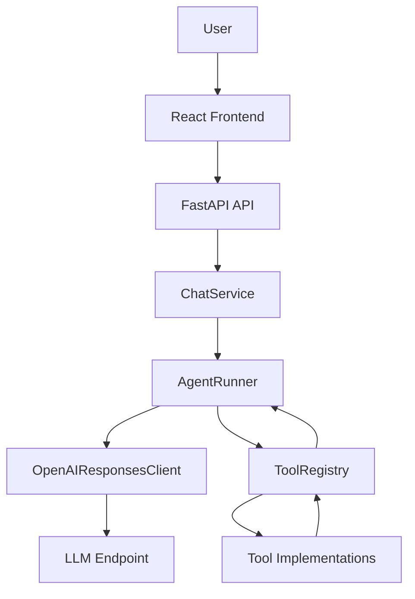
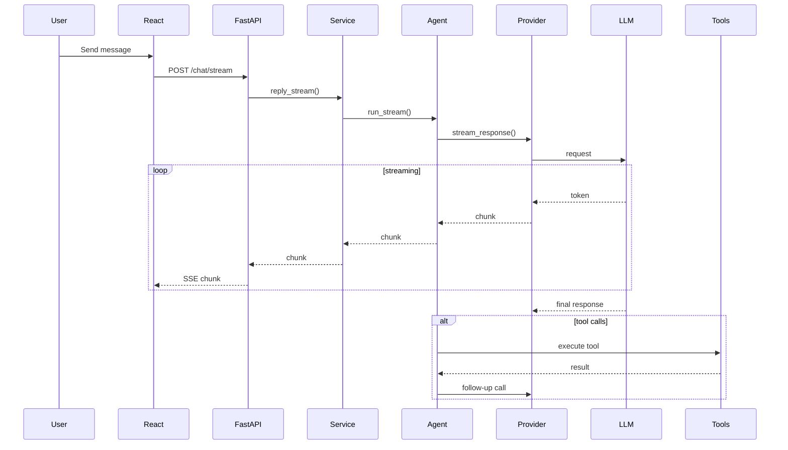
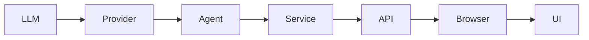
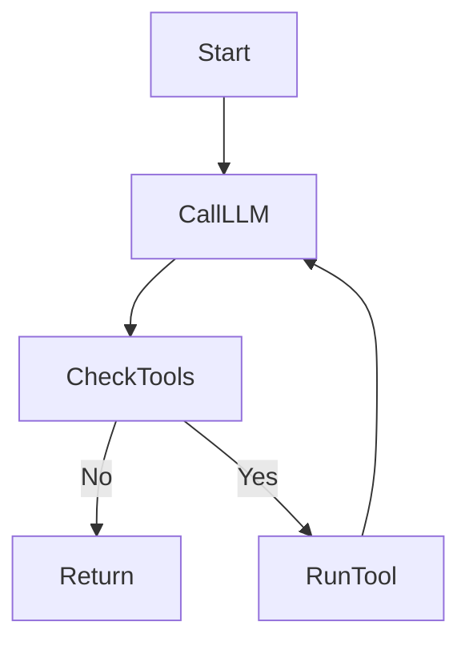
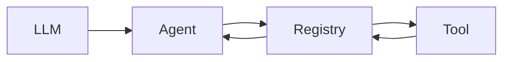
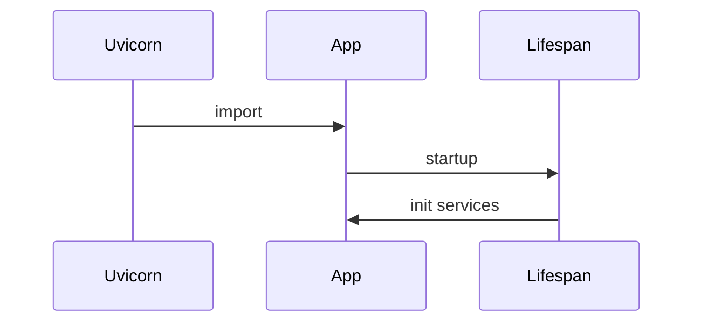
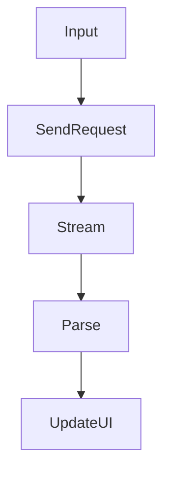
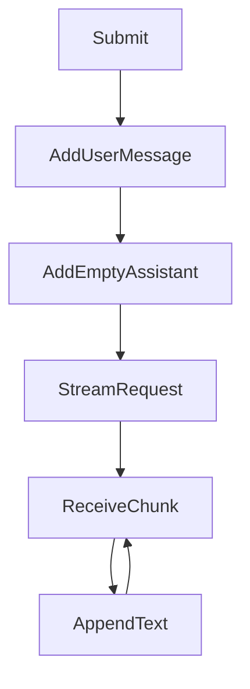

# 🧠 Agentic Chatbot (Streaming + Tool Calling)

A minimal but **production-grade chatbot system** built with:

* ⚡ FastAPI (backend)
* ⚛️ React + Vite (frontend)
* 🤖 Agentic reasoning loop
* 🌊 Real-time streaming (SSE)
* 🧩 Modular architecture

---

# 📦 Project Structure

```
.
├── app
│   ├── agent/              # Agent orchestration logic
│   ├── api/                # FastAPI routes
│   ├── core/               # Config + logging
│   ├── providers/          # LLM provider abstraction
│   ├── services/           # Business logic layer
│   ├── tools/              # Tool registry + implementations
│   ├── schemas/            # Pydantic models
│   ├── dependencies.py     # Dependency injection
│   └── main.py             # FastAPI entrypoint
├── pyproject.toml
└── uv.lock
```

---

# 🚀 Overview

This project implements an **agentic chatbot system** where:

* the LLM can call tools
* responses are streamed in real-time
* the backend is cleanly layered
* the frontend renders streaming tokens live

---

# 🧩 Architecture Overview



---

# 🔁 End-to-End Flow



---

# 🌊 Streaming Architecture



Streaming is implemented via:

* FastAPI `StreamingResponse`
* SSE (Server-Sent Events)
* Browser `ReadableStream`

---

# 🧠 Core Components

## 1. `main.py` — App Composition

Responsible for wiring everything:

```python
registry = build_registry()
llm = OpenAIResponsesClient(...)
agent = AgentRunner(...)
chat_service = ChatService(agent)
set_chat_service(chat_service)
```

This is your **dependency composition root**.

---

## 2. `AgentRunner` — The Brain

Handles:

* multi-step reasoning
* tool execution loop
* streaming tokens
* iteration control



---

## 3. `OpenAIResponsesClient`

Handles:

* LLM API calls
* streaming tokens
* returning final responses

---

## 4. `ChatService`

Thin abstraction layer:

```python
reply()         # non-streaming
reply_stream()  # streaming
```

---

## 5. FastAPI Router

Provides endpoints:

```
POST /api/chat
POST /api/chat/stream
```

Streaming uses SSE:

```
data: {"type": "chunk", "content": "..."}
```

---

## 6. Tool System



---

# 🔧 Startup Flow



---

# ⚛️ Frontend Flow



---

# 🖥️ Frontend Streaming Logic



---

# 🔄 Streaming vs Non-Streaming

| Mode   | Behavior                |
| ------ | ----------------------- |
| Chat   | waits for full response |
| Stream | updates UI live         |

---

# 🛠️ Running the Project

## Backend

```bash
cd backend
uv run uvicorn app.main:app --reload
```

Server:

```
http://127.0.0.1:8000
```

---

## Frontend

```bash
cd frontend
npm install
npm run dev
```

App:

```
http://localhost:5173
```

---

# 🔍 Debugging Tips

## Import errors

Make sure every folder has:

```
__init__.py
```

---

## Router errors

Correct import:

```python
from app.api.chat_router import router
```

---

## Streaming issues

Check:

* SSE headers
* frontend parsing
* buffering proxies

---

# 🚀 Future Improvements

* chat history (memory)
* WebSocket streaming
* persistent sessions
* retry + rate limits
* observability (logs + traces)

---

# 🧠 Design Philosophy

This project follows:

* separation of concerns
* dependency injection
* streaming-first UX
* agent + tools pattern

---

# 🏁 Summary

You now have:

* real-time streaming chatbot
* tool-calling agent
* clean backend architecture
* modular frontend

This is already close to **production-grade design**.

---

## Want next steps?

I can help you add:

* memory (chat history)
* WebSockets instead of SSE
* structured tool validation
* logging + tracing

Just ask 🚀
