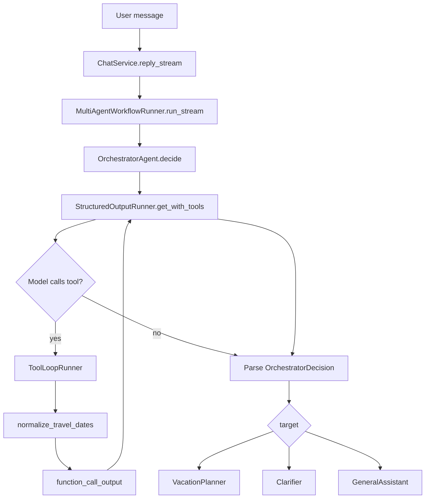
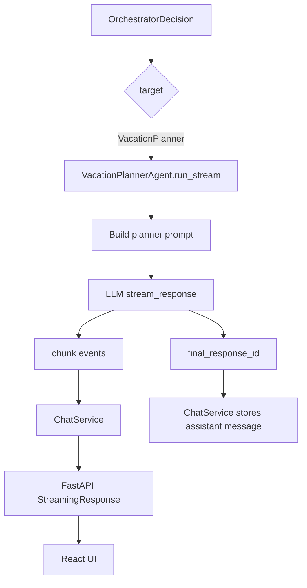
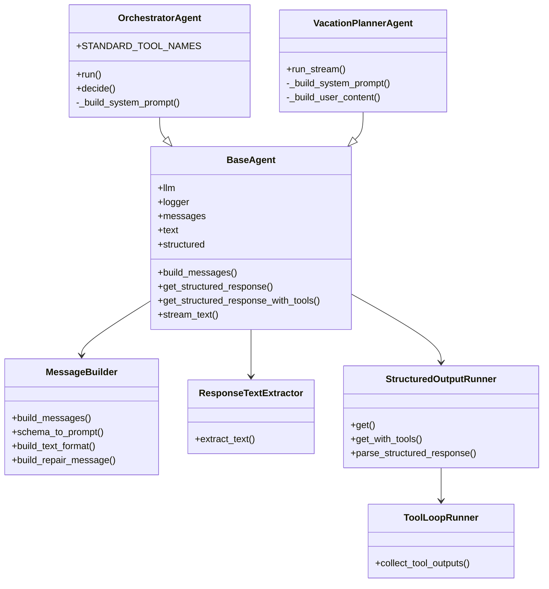

# Multi-Agent Vacation Planner — Compact Handoff Notes

## Project Goal

We are converting a working **FastAPI + React streaming chatbot** from a single-agent ReAct-style runner into a **multi-agent vacation planner**.

The target design is an **orchestrator-worker workflow**:

```text
React UI
  ↓ SSE chunks
FastAPI ChatService
  ↓
MultiAgentWorkflowRunner
  ↓
OrchestratorAgent
  ↓
VacationPlannerAgent / ClarifierAgent / GeneralAssistantAgent
```

Reference ideas:

- Anthropic describes **orchestrator-workers** as a workflow where a central LLM delegates tasks to worker LLMs and synthesizes results.
- OpenAI describes **orchestration and handoffs** as patterns for deciding which agents run, when they run, and when a specialist should take over.
- For the code design, we are using **composition over deep inheritance**: small focused helper classes are easier to test and maintain than one huge base class.

Useful references:

- https://www.anthropic.com/research/building-effective-agents
- https://developers.openai.com/api/docs/guides/agents/orchestration
- https://python-patterns.guide/gang-of-four/composition-over-inheritance/
- https://realpython.com/inheritance-composition-python/

---

## What Works Now

### 1. Streaming is working

The React frontend expects SSE events like:

```json
{"type": "chunk", "content": "..."}
{"type": "done"}
{"type": "error", "message": "..."}
```

Backend streaming path:

```text
ChatService.reply_stream()
  ↓
agent.run_stream()
  ↓
yield {"type": "chunk", "content": chunk}
  ↓
FastAPI StreamingResponse
  ↓
React appends chunks
```

Important backend event contract:

```python
{"type": "chunk", "content": "..."}
{"type": "reasoning", "content": "..."}   # optional
{"type": "completed", "final_response_id": "..."}
```

`ChatService` collects streamed assistant chunks, stores the final assistant message, and saves the final user-facing `response_id`.

---

### 2. OrchestratorAgent is implemented

The orchestrator:

- inherits from `BaseAgent`
- extracts structured travel-planning state
- routes the request to exactly one target:
  - `VacationPlanner`
  - `Clarifier`
  - `GeneralAssistant`
- uses Pydantic structured output
- can call a restricted date-normalization tool

Current schema:

```python
class OrchestratorDecision(BaseModel):
    model_config = ConfigDict(extra="forbid")

    target: Literal["VacationPlanner", "Clarifier", "GeneralAssistant"]

    destination: str | None = None
    duration_days: int | None = None
    start_date: str | None = None
    end_date: str | None = None
    is_date_range_clear: bool = False

    travelers: int | None = None
    budget: str | None = None

    interests: list[str] = Field(default_factory=list)
    missing_fields: list[str] = Field(default_factory=list)
    blocking_missing_fields: list[str] = Field(default_factory=list)

    @field_validator(
        "interests",
        "missing_fields",
        "blocking_missing_fields",
        mode="before",
    )
    @classmethod
    def none_to_empty_list(cls, value: Any) -> Any:
        if value is None:
            return []
        return value
```

---

### 3. BaseAgent was refactored into smaller core components

We split the old large `BaseAgent` into focused files:

```text
app/agent/core/
├── base.py
├── messages.py
├── response_text.py
├── structured_output.py
├── tool_loop.py
└── errors.py
```

Responsibilities:

```text
base.py
  Small shared parent for concrete agents.
  Owns llm, logger, and helper components.
  Does NOT implement run() or run_stream().

messages.py
  Builds messages.
  Builds schema prompt text.
  Builds text_format for JSON schema structured output.
  Builds repair messages after validation failure.

response_text.py
  Extracts text from final Responses API objects.

structured_output.py
  Handles Pydantic structured output.
  Handles retries after validation failure.
  Handles structured output with tools.

tool_loop.py
  Executes model-requested function/tool calls.
  Converts function_call items into function_call_output messages.

errors.py
  Defines StructuredOutputError and error helpers.
```

The current design uses inheritance only for actual agents:

```text
OrchestratorAgent is a BaseAgent
VacationPlannerAgent will be a BaseAgent
ClarifierAgent will be a BaseAgent
GeneralAssistantAgent will be a BaseAgent
```

Reusable behavior is composed through helper classes:

```text
BaseAgent
  has MessageBuilder
  has ResponseTextExtractor
  has StructuredOutputRunner
```

---

### 4. Structured output with tools is implemented

We added this method on `BaseAgent` through `StructuredOutputRunner`:

```python
await self.get_structured_response_with_tools(
    messages=messages,
    schema=OrchestratorDecision,
    tools=self.tools,
    previous_response_id=None,
    max_tool_iterations=2,
    max_retries=2,
)
```

Conceptual flow:

```text
LLM call with tools + structured output
  ↓
model may emit function_call
  ↓
ToolLoopRunner executes tool
  ↓
tool output is sent back
  ↓
LLM returns final structured JSON
  ↓
Pydantic validates into OrchestratorDecision
```

---

### 5. Date normalization tool is implemented and working

Tool name:

```text
normalize_travel_dates
```

Purpose:

```text
natural-language date phrase
  → ISO start_date / end_date
```

Examples:

```text
"next weekend"
"this weekend"
"tomorrow"
"in two weeks"
"May 3rd"
"from June 1 to June 5"
```

It uses:

- `dateparser`
- custom weekend logic
- defensive argument handling

Important learned issue:

The local model may pass imperfect arguments, for example:

```json
{"duration_days": "null"}
```

So the tool was made defensive by accepting:

```python
duration_days: Any = None
```

and by using this safe helper:

```python
def _safe_duration_days(
    duration_days: Any,
    default: int,
) -> int:
    if duration_days is None:
        return default

    if isinstance(duration_days, str):
        cleaned = duration_days.strip().lower()

        if cleaned in {"", "null", "none", "unknown"}:
            return default

        if cleaned.isdigit():
            duration_days = int(cleaned)
        else:
            return default

    if not isinstance(duration_days, int):
        return default

    return max(1, min(duration_days, 60))
```

The date tool is now confirmed to be called from logs:

```text
DATE NORMALIZER IS CALLED
TOOL EXECUTED: name=normalize_travel_dates ok=True
```

---

### 6. Orchestrator tool access is restricted

The orchestrator should only have this tool:

```python
STANDARD_TOOL_NAMES = ("normalize_travel_dates",)
```

Inside `OrchestratorAgent.__init__`:

```python
self.tools = registry.subset(list(self.STANDARD_TOOL_NAMES))
```

This guarantees:

```text
1. The model only sees the normalize_travel_dates schema.
2. ToolSet.run() rejects any tool outside the allowed list.
```

Startup logs confirmed:

```text
ORCHESTRATOR TOOL NAMES: ['normalize_travel_dates']
```

---

### 7. Logging issue was found and fixed

Incorrect:

```python
logger.info("ORCHESTRATOR PARSED:", decision)
```

Correct:

```python
logger.info("ORCHESTRATOR PARSED: %s", decision)
logger.info("ORCHESTRATOR RESPONSE ID: %s", orchestrator_response_id)
```

Reason: Python logging uses `%`-style lazy formatting when arguments are passed.

---

## Current Working Flow

```text
User:
"give me a plan for visiting Athens next weekend"

React frontend
  ↓
FastAPI /api/chat/stream
  ↓
ChatService.reply_stream()
  ↓
MultiAgentWorkflowRunner.run_stream()
  ↓
OrchestratorAgent.run()
  ↓
OrchestratorAgent.decide()
  ↓
get_structured_response_with_tools()
  ↓
LLM calls normalize_travel_dates
  ↓
ToolLoopRunner executes normalize_travel_dates
  ↓
LLM returns OrchestratorDecision
  ↓
MultiAgentWorkflowRunner sees target="VacationPlanner"
  ↓
VacationPlannerAgent.run_stream()   # next phase
  ↓
stream chunks back to React
```

---

## Flow Diagram: Current Orchestrator Phase



---

## Flow Diagram: Desired VacationPlanner Phase



---

## Code Architecture Diagram



---

## Next Phases

### Phase 1 — Finish minimal VacationPlannerAgent

Goal:

```text
Orchestrator decides target=VacationPlanner
VacationPlannerAgent streams a user-facing travel plan
No tools yet
```

Tasks:

```text
1. Create app/agent/workers/vacation_planner.py
2. Implement VacationPlannerAgent(BaseAgent)
3. It receives:
   - user_input
   - planning_state: OrchestratorDecision
   - previous_response_id
4. It streams chunks using llm.stream_response(..., tools=[])
5. MultiAgentWorkflowRunner delegates to it when target == VacationPlanner
6. ChatService stores VacationPlanner response_id, not orchestrator response_id
```

Important rule:

```text
orchestrator response_id = internal only
vacation planner response_id = user-facing final_response_id
```

---

### Phase 2 — Add ClarifierAgent

Goal:

```text
When blocking_missing_fields is not empty,
stream a natural clarification question.
```

Example:

```text
User: "plan me a trip"

Orchestrator:
  target=Clarifier
  blocking_missing_fields=["destination", "duration"]

ClarifierAgent:
  "Sure — where would you like to go, and for how many days?"
```

Tasks:

```text
1. Create app/agent/workers/clarifier.py
2. Implement ClarifierAgent(BaseAgent)
3. Use decision.blocking_missing_fields
4. Stream concise clarification question
```

---

### Phase 3 — Add GeneralAssistantAgent

Goal:

```text
Non-travel requests should not go to vacation planner.
```

Tasks:

```text
1. Create app/agent/workers/general_assistant.py
2. Implement basic streaming assistant
3. Route target=GeneralAssistant to it
```

---

### Phase 4 — Add planner tools

Once the basic `VacationPlannerAgent` streams correctly, give it a restricted toolset.

Possible planner tools:

```text
get_weather_forecast
search_web_duckduckgo
get_wikipedia_place_info
```

Recommended toolset:

```python
VACATION_PLANNER_TOOL_NAMES = (
    "get_weather_forecast",
    "search_web_duckduckgo",
    "get_wikipedia_place_info",
)
```

Flow:

```text
VacationPlannerAgent
  ↓
LLM may call weather/wiki/web tools
  ↓
ToolLoopRunner executes tools
  ↓
LLM streams final itinerary
```

Do not give the planner every tool by default.

---

### Phase 5 — Extract reusable StreamingToolAgent if needed

Only after `VacationPlannerAgent` works and another worker needs the same streaming/tool loop, extract:

```text
StreamingToolAgent(BaseAgent)
```

It can own reusable logic similar to the old `AgentRunner`:

```text
first model turn
tool loop
follow-up model turn
stream chunks
emit completed event
```

Do this only when reuse is real. Avoid premature inheritance.

---

### Phase 6 — Improve planning quality

Later additions:

```text
1. Add itinerary schema/evaluator
2. Add budget-aware planning
3. Add weather-aware planning
4. Add source links for live recommendations
5. Add memory/conversation context handling
6. Add tests for OrchestratorDecision and date normalization
```

---

## Key Design Decisions

### 1. Orchestrator is structured, not user-facing

The orchestrator should produce:

```text
routing + planning state
```

It should not produce the final answer.

### 2. Workers are user-facing

The `VacationPlannerAgent` should stream the actual itinerary.

### 3. Tools are restricted per agent

Each agent should define its own standard tool names.

Example:

```python
class OrchestratorAgent(BaseAgent):
    STANDARD_TOOL_NAMES = ("normalize_travel_dates",)
```

Later:

```python
class VacationPlannerAgent(BaseAgent):
    STANDARD_TOOL_NAMES = (
        "get_weather_forecast",
        "search_web_duckduckgo",
        "get_wikipedia_place_info",
    )
```

### 4. Composition over deep inheritance

`BaseAgent` should stay small.

Reusable logic lives in:

```text
MessageBuilder
ResponseTextExtractor
StructuredOutputRunner
ToolLoopRunner
```

Use inheritance only for clear “is an agent” relationships:

```text
OrchestratorAgent is a BaseAgent
VacationPlannerAgent is a BaseAgent
ClarifierAgent is a BaseAgent
GeneralAssistantAgent is a BaseAgent
```

---

## Current Known Fixes Needed

### Fix 1 — defensive date tool arguments

Make sure `duration_days` accepts imperfect LLM values:

```python
duration_days: Any = None
```

and use `_safe_duration_days()`.

### Fix 2 — logging formatting

Use:

```python
logger.info("ORCHESTRATOR PARSED: %s", decision)
```

not:

```python
logger.info("ORCHESTRATOR PARSED:", decision)
```

### Fix 3 — keep final_response_id correct

In `MultiAgentWorkflowRunner`, completed event should use the final worker response id.

```text
Do not save orchestrator response_id as conversation.last_response_id.
```

---

## Suggested Next Prompt for Continuation

```text
We are building a FastAPI + React multi-agent vacation planner.

We have already implemented:
- ToolRegistry / ToolSet / ToolExecutor
- BaseAgent split into:
  - base.py
  - messages.py
  - response_text.py
  - structured_output.py
  - tool_loop.py
  - errors.py
- OrchestratorAgent(BaseAgent)
- OrchestratorDecision Pydantic schema
- normalize_travel_dates tool
- OrchestratorAgent uses get_structured_response_with_tools()
- Orchestrator has only normalize_travel_dates via registry.subset()
- Date normalization now works.
- Streaming frontend works.
- The next step is implementing VacationPlannerAgent(BaseAgent), initially without tools, streaming a user-facing itinerary from OrchestratorDecision.

Please help me implement VacationPlannerAgent and wire it into MultiAgentWorkflowRunner step by step.
```